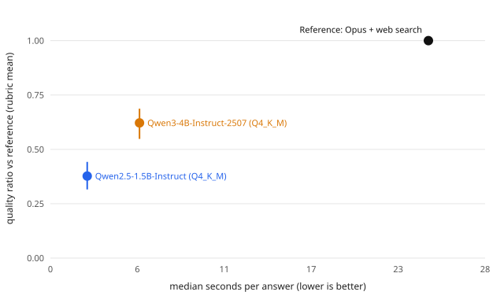

# BOAR eval: baseline-v1

TL;DR: quality of on-device answers relative to a frontier model with web search, and seconds per answer. Dataset `v1`, scope `s32` (32 questions). Regenerate with `npm --prefix eval run report`.

## Results

| System | Quality ratio (95% CI) | Correct answers (correctness ≥ 4) | Win / tie / loss vs ref | Win score (95% CI) | Position-consistent | Median s (p90) | TTFT s | tok/s | KB hit | Success |
|---|---|---|---|---|---|---|---|---|---|---|
| Qwen2.5-1.5B-Instruct (Q4_K_M) | 0.38 (0.32–0.44) | 16% | 0% / 3% / 97% | 0.02 (0.00–0.05) | 100% | 2.4 (4.2) | 0.9 | 57 | 0% | 100% |
| Qwen3-4B-Instruct-2507 (Q4_K_M) | 0.62 (0.55–0.69) | 66% | 0% / 3% / 97% | 0.02 (0.00–0.05) | 100% | 5.8 (8.2) | 2.5 | 24 | 0% | 100% |
| Reference (Opus + web search) | 1.00 | 100% | – | – | – | 24.5 | – | – | – | 100% |

Quality ratio = mean rubric score of the BOAR answer / mean rubric score of the reference answer (rubric: correctness, completeness, usefulness, 1–5 each). Win score = wins + ½ ties. CIs are percentile bootstrap over questions (2,000 resamples, seeded).

## Rubric means

| System | correctness (BOAR / ref) | completeness (BOAR / ref) | usefulness (BOAR / ref) |
|---|---|---|---|
| Qwen2.5-1.5B-Instruct (Q4_K_M) | 2.13 / 4.86 | 1.78 / 4.97 | 1.69 / 5.00 |
| Qwen3-4B-Instruct-2507 (Q4_K_M) | 3.80 / 4.84 | 2.72 / 4.98 | 2.70 / 5.00 |

## Per category (win score)

| System | compare | explain | hard-for-1b | multistep | synthesis | traveler-firstaid | traveler-geo | traveler-lang |
|---|---|---|---|---|---|---|---|---|
| Qwen2.5-1.5B-Instruct (Q4_K_M) | 0.00 | 0.00 | 0.00 | 0.13 | 0.00 | 0.00 | 0.00 | 0.00 |
| Qwen3-4B-Instruct-2507 (Q4_K_M) | 0.00 | 0.00 | 0.00 | 0.13 | 0.00 | 0.00 | 0.00 | 0.00 |

## Judge calibration

20 pairs labeled by hand (blind, before reading the judge's verdict) vs the combined judge verdict: agreement 75%, Cohen's kappa 0.00 (kappa is unstable when almost every label is the same class). Labeler: Sextant (Claude Opus 5.5 agent), blind to system names; answer style can reveal the system.

| hand \ judge | boar | tie | ref |
|---|---|---|---|
| boar | 0 | 0 | 0 |
| tie | 0 | 0 | 5 |
| ref | 0 | 0 | 15 |

Read: disagreements are hand 'tie' vs judge 'ref' on answers that are correct but less complete. On those the judge still scored BOAR correctness 4-5 and docked completeness, so hand and judge disagree on the tie threshold, not on facts. That is why the report also shows the correct-answer rate.

## Method

- **BOAR answers**: desktop runner (`eval/runner/desktop.ts`) replaying the app pipeline (same classifier, lexical+semantic retrieval, fusion, prompt assembly, succinct personality, 512 max tokens, temperature 0.7, seed 42) with node-llama-cpp on Apple M4 metal. Every GGUF is checked against a pinned sha256 before loading. Latency here is a desktop proxy, not phone latency.
- **Reference**: Claude Code headless (`claude -p`, model claude-opus-5-5, CLI 2.1.283 (Claude Code)) with only WebSearch and WebFetch, fixed prompt `eval/prompts/reference.v1.md`, run once per question. Reference latency includes web search round-trips.
- **Judge**: Claude Code headless with no tools, blind pairwise comparison (citations, links, source lists and bold stripped from both answers), each pair judged in both A/B orders, first order drawn from a recorded seed. Orders that disagree count as a tie.
- **Consumption**: runs on the user's Claude Code subscription; no API key, no gateway. Cost below is the CLI's list-price equivalent, not a charge.

## Limitations

- **Judge and reference are the same family (Claude).** Self-preference bias would favor the reference, so BOAR's ratio is, if anything, understated. A second judge family is not available without a paid API (forbidden for now).
- Author notes in the dataset guide the judge; they can be incomplete or outdated for time-sensitive facts.
- Desktop latency (Apple M4, Metal) is not phone latency; device numbers come from `scripts/eval-device.mjs`.
- The host was busy during some runs (1-min load average up to 281.8): Qwen2.5-1.5B-Instruct (Q4_K_M), Qwen3-4B-Instruct-2507 (Q4_K_M). Latency may be inflated.

## Consumption

Cumulative list-price equivalent logged in `results/spend.jsonl`: US$8.93.
