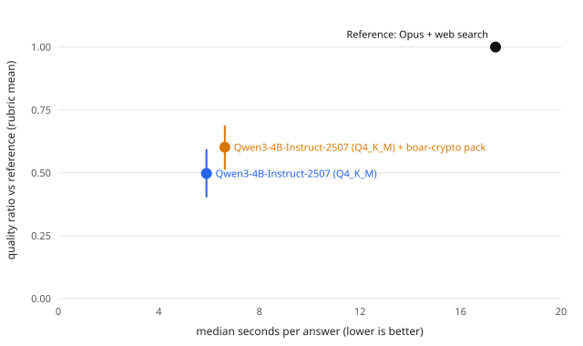

# BOAR eval: cryptopack-v1

TL;DR: quality of on-device answers relative to a frontier model with web search, and seconds per answer. Dataset `cryptopack`, scope `all` (all questions). Regenerate with `node eval/scripts/report.mjs --dataset cryptopack --subset all --name cryptopack-v1` (all official reports: `npm --prefix eval run report:official`).

## Headline

- **Qwen3-4B-Instruct-2507 (Q4_K_M) + boar-crypto pack** reaches **60%** of the reference's rubric score (95% CI 51%–69%, Claude judge, 20 questions) / **74%** (65%–82%, Jev judge, 20) in **6.6 s** median per answer, vs 17.4 s for the reference. Correct answers: 65% (reference 98%).
- **Qwen3-4B-Instruct-2507 (Q4_K_M)** reaches **50%** of the reference's rubric score (95% CI 40%–59%, Claude judge, 20 questions) / **62%** (52%–71%, Jev judge, 20) in **5.9 s** median per answer, vs 17.4 s for the reference. Correct answers: 40% (reference 98%).

The reference wins almost every head-to-head pair; the ratio measures how much of its quality BOAR keeps, offline and on device-class hardware.

## Results

| System | Judged | Quality ratio (95% CI) | Correct answers (correctness ≥ 4) | Win / tie / loss vs ref | Win score (95% CI) | Position-consistent | Median s (p90) | TTFT s | tok/s | KB hit | Success |
|---|---|---|---|---|---|---|---|---|---|---|---|
| Qwen3-4B-Instruct-2507 (Q4_K_M) | 20 | 0.50 (0.40–0.59) | 40% | 0% / 5% / 95% | 0.03 (0.00–0.07) | 100% | 5.9 (8.1) | 2.5 | 22 | 0% | 100% |
| Qwen3-4B-Instruct-2507 (Q4_K_M) + boar-crypto pack | 20 | 0.60 (0.51–0.69) | 65% | 5% / 5% / 90% | 0.07 (0.00–0.20) | 100% | 6.6 (8.3) | 2.9 | 22 | 54% | 100% |
| Reference (Opus + web search) | – | 1.00 | 98% | – | – | – | 17.4 | – | – | – | 100% |

Quality ratio = mean rubric score of the BOAR answer / mean rubric score of the reference answer (rubric: correctness, completeness, usefulness, 1–5 each). Win score = wins + ½ ties. CIs are percentile bootstrap over questions (2,000 resamples, seeded).

## Second judge (Jev, another model family)

Same blinded pairs, rubric and A/B orders, judged by typesafe-ai/jev through the Vercel AI Gateway (eval time only). Agreement between the two judges: `reports/judges-cryptopack-all.md`.

| System | n | Quality ratio (95% CI) | Correct answers | Win / tie / loss vs ref |
|---|---|---|---|---|
| Qwen3-4B-Instruct-2507 (Q4_K_M) | 20 | 0.62 (0.52–0.71) | 35% | 0% / 0% / 100% |
| Qwen3-4B-Instruct-2507 (Q4_K_M) + boar-crypto pack | 20 | 0.74 (0.65–0.82) | 60% | 0% / 0% / 100% |

## Rubric means

| System | correctness (BOAR / ref) | completeness (BOAR / ref) | usefulness (BOAR / ref) |
|---|---|---|---|
| Qwen3-4B-Instruct-2507 (Q4_K_M) | 3.00 / 4.88 | 2.17 / 5.00 | 2.20 / 4.95 |
| Qwen3-4B-Instruct-2507 (Q4_K_M) + boar-crypto pack | 3.67 / 4.88 | 2.63 / 5.00 | 2.63 / 4.95 |

## Per category (correct answers · quality ratio)

| System | crypto-descriptive | crypto-named |
|---|---|---|
| Qwen3-4B-Instruct-2507 (Q4_K_M) | 70% · 0.61 | 10% · 0.38 |
| Qwen3-4B-Instruct-2507 (Q4_K_M) + boar-crypto pack | 70% · 0.66 | 60% · 0.55 |

Win scores per category are omitted: the reference wins almost every pair, so they are all near 0.

## Judge calibration

Not run yet.

## Method

- **BOAR answers**: desktop runner (`eval/runner/desktop.ts`) replaying the app pipeline (same classifier, lexical+semantic retrieval, fusion, prompt assembly, succinct personality, 512 max tokens, temperature 0.7, seed 42) with node-llama-cpp on Apple M4 metal. Every GGUF is checked against a pinned sha256 before loading. Latency here is a desktop proxy, not phone latency.
- **Reference**: Claude Code headless (`claude -p`, model claude-opus-5-5, CLI 2.1.283 (Claude Code)) with only WebSearch and WebFetch, fixed prompt `eval/prompts/reference.v1.md`, run once per question. Reference latency includes web search round-trips.
- **Judge**: Claude Code headless with no tools, blind pairwise comparison (citations, links, source lists and bold stripped from both answers), each pair judged in both A/B orders, first order drawn from a recorded seed. Orders that disagree count as a tie.
- **Consumption**: runs on the user's Claude Code subscription; no API key, no gateway. Cost below is the CLI's list-price equivalent, not a charge.

## Limitations

- **The main judge and the reference are the same family (Claude).** Self-preference bias would favor the reference, so BOAR's ratio is, if anything, understated. The second judge (Jev, another family) is the check on that bias.
- Author notes in the dataset guide the judge; they can be incomplete or outdated for time-sensitive facts.
- Desktop latency (Apple M4, Metal) is not phone latency; device numbers come from `scripts/eval-device.mjs`.
- The host was busy during some runs (1-min load average up to 120.6): Qwen3-4B-Instruct-2507 (Q4_K_M), Qwen3-4B-Instruct-2507 (Q4_K_M) + boar-crypto pack. Latency may be inflated.

## Consumption

Cumulative list-price equivalent logged in `results/spend.jsonl`: US$31.12.
