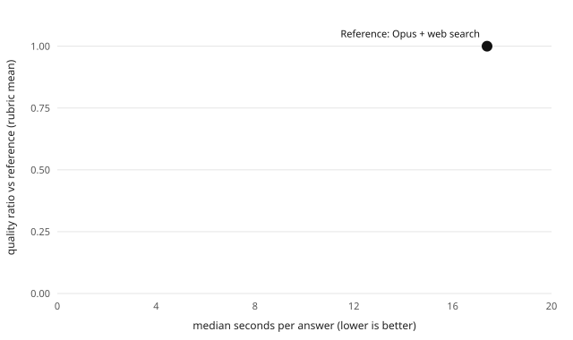

# BOAR eval: official-cryptopack-6c3d6c6

TL;DR: quality of on-device answers relative to a frontier model with web search, and seconds per answer. Dataset `cryptopack`, scope `all` (all questions). Regenerate with `node eval/scripts/report.mjs --dataset cryptopack --subset all --name official-cryptopack-6c3d6c6 --systems qwen3-4b-instruct-2507-q4km__official-6c3d6c6` (all official reports: `npm --prefix eval run report:official`).

## Results

| System | Judged | Quality ratio (95% CI) | Correct answers (correctness ≥ 4) | Win / tie / loss vs ref | Win score (95% CI) | Position-consistent | Median s (p90) | TTFT s | tok/s | KB hit | Success |
|---|---|---|---|---|---|---|---|---|---|---|---|
| Qwen3-4B-Instruct-2507 (Q4_K_M) + boar-preparedness, boar-crypto pack | 0 | not judged | – | – | – | – | 3.5 (4.5) | 1.2 | 35 | 38% | 100% |
| Reference (Opus + web search) | – | 1.00 | n/a | – | – | – | 17.4 | – | – | – | 100% |

Quality ratio = mean rubric score of the BOAR answer / mean rubric score of the reference answer (rubric: correctness, completeness, usefulness, 1–5 each). Win score = wins + ½ ties. CIs are percentile bootstrap over questions (2,000 resamples, seeded).

## Second judge (Jev, another model family)

Same blinded pairs, rubric and A/B orders, judged by typesafe-ai/jev through the Vercel AI Gateway (eval time only). Agreement between the two judges: `reports/judges-cryptopack-all.md`.

| System | n | Quality ratio (95% CI) | Correct answers | Win / tie / loss vs ref |
|---|---|---|---|---|
| Qwen3-4B-Instruct-2507 (Q4_K_M) + boar-preparedness, boar-crypto pack | 20 | 0.68 (0.59–0.77) | 55% | 0% / 5% / 95% |

## Rubric means

| System | correctness (BOAR / ref) | completeness (BOAR / ref) | usefulness (BOAR / ref) |
|---|---|---|---|

## Per category (correct answers · quality ratio)

| System |  |
|---||

Win scores per category are omitted: the reference wins almost every pair, so they are all near 0.

## Judge calibration

Not run yet.

## Method

- **BOAR answers**: desktop runner (`eval/runner/desktop.ts`) replaying the app pipeline (same classifier, lexical+semantic retrieval, fusion, prompt assembly, succinct personality, 512 max tokens, temperature 0.7, seed 42) with node-llama-cpp on Apple M4 metal. Every GGUF is checked against a pinned sha256 before loading. Latency here is a desktop proxy, not phone latency.
- **Reference**: Claude Code headless (`claude -p`, model claude-opus-5-5, CLI 2.1.283 (Claude Code)) with only WebSearch and WebFetch, fixed prompt `eval/prompts/reference.v1.md`, run once per question. Reference latency includes web search round-trips.
- **Judge**: Claude Code headless with no tools, blind pairwise comparison (citations, links, source lists and bold stripped from both answers), each pair judged in both A/B orders, first order drawn from a recorded seed. Orders that disagree count as a tie.
- **Consumption**: runs on the user's Claude Code subscription; no API key, no gateway. Cost below is the CLI's list-price equivalent, not a charge.

## Limitations

- **The main judge and the reference are the same family (Claude).** Self-preference bias would favor the reference, so BOAR's ratio is, if anything, understated. The second judge (Jev, another family) is the check on that bias.
- Author notes in the dataset guide the judge; they can be incomplete or outdated for time-sensitive facts.
- Desktop latency (Apple M4, Metal) is not phone latency; device numbers come from `scripts/eval-device.mjs`.

## Consumption

Cumulative list-price equivalent logged in `results/spend.jsonl`: US$41.54.
