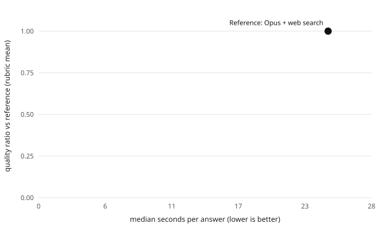

# BOAR eval: s32-gate-control-a8ee6bf-candidate-be817b3-r2

TL;DR: quality of on-device answers relative to a frontier model with web search, and seconds per answer. Dataset `v1`, scope `s32` (32 questions). Regenerate with `node eval/scripts/report.mjs --subset s32 --name s32-gate-control-a8ee6bf-candidate-be817b3-r2 --systems qwen2.5-1.5b-instruct-q4km__essential__app__control-a8ee6bf,qwen3-4b-instruct-2507-q4km__essential__app__control-a8ee6bf,qwen2.5-1.5b-instruct-q4km__essential__app__candidate-be817b3-r2,qwen3-4b-instruct-2507-q4km__essential__app__candidate-be817b3-r2` (all official reports: `npm --prefix eval run report:official`).

## Results

| System | Judged | Quality ratio (95% CI) | Correct answers (correctness ≥ 4) | Win / tie / loss vs ref | Win score (95% CI) | Position-consistent | Median s (p90) | TTFT s | tok/s | KB hit | Success |
|---|---|---|---|---|---|---|---|---|---|---|---|
| Qwen2.5-1.5B-Instruct (Q4_K_M) [candidate-be817b3-r2] | 0 | not judged | – | – | – | – | 0.5 (0.6) | 0.5 | 83 | 0% | 34% |
| Qwen2.5-1.5B-Instruct (Q4_K_M) [control-a8ee6bf] | 0 | not judged | – | – | – | – | 0.9 (1.3) | 0.9 | 83 | 0% | 100% |
| Qwen3-4B-Instruct-2507 (Q4_K_M) [candidate-be817b3-r2] | 0 | not judged | – | – | – | – | 2.6 (3.6) | 2.6 | 35 | 0% | 100% |
| Qwen3-4B-Instruct-2507 (Q4_K_M) [control-a8ee6bf] | 0 | not judged | – | – | – | – | 2.9 (3.6) | 2.9 | 35 | 0% | 100% |
| Reference (Opus + web search) | – | 1.00 | n/a | – | – | – | 24.5 | – | – | – | 100% |

Quality ratio = mean rubric score of the BOAR answer / mean rubric score of the reference answer (rubric: correctness, completeness, usefulness, 1–5 each). Win score = wins + ½ ties. CIs are percentile bootstrap over questions (2,000 resamples, seeded).

## Second judge (Jev, another model family)

Same blinded pairs, rubric and A/B orders, judged by typesafe-ai/jev through the Vercel AI Gateway (eval time only). Agreement between the two judges: `reports/judges-v1-s32.md`.

| System | n | Quality ratio (95% CI) | Correct answers | Win / tie / loss vs ref |
|---|---|---|---|---|
| Qwen2.5-1.5B-Instruct (Q4_K_M) [candidate-be817b3-r2] | 32 | 0.29 (0.24–0.33) | 6% | 0% / 0% / 100% |
| Qwen2.5-1.5B-Instruct (Q4_K_M) [control-a8ee6bf] | 32 | 0.52 (0.45–0.59) | 31% | 0% / 3% / 97% |
| Qwen3-4B-Instruct-2507 (Q4_K_M) [candidate-be817b3-r2] | 32 | 0.67 (0.61–0.73) | 63% | 0% / 3% / 97% |
| Qwen3-4B-Instruct-2507 (Q4_K_M) [control-a8ee6bf] | 32 | 0.70 (0.63–0.75) | 63% | 0% / 3% / 97% |

## Rubric means

| System | correctness (BOAR / ref) | completeness (BOAR / ref) | usefulness (BOAR / ref) |
|---|---|---|---|

## Per category (correct answers · quality ratio)

| System |  |
|---||

Win scores per category are omitted: the reference wins almost every pair, so they are all near 0.

## Judge calibration

0 pairs labeled by hand (blind, before reading the judge's verdict) vs the combined judge verdict: agreement 0%, Cohen's kappa n/a (kappa is unstable when almost every label is the same class). Labeler: Sextant (Claude Opus 5.5 agent), blind to system names; answer style can reveal the system.

| hand \ judge | boar | tie | ref |
|---|---|---|---|
| boar | 0 | 0 | 0 |
| tie | 0 | 0 | 0 |
| ref | 0 | 0 | 0 |

Read: disagreements are hand 'tie' vs judge 'ref' on answers that are correct but less complete. On those the judge still scored BOAR correctness 4-5 and docked completeness, so hand and judge disagree on the tie threshold, not on facts. That is why the report also shows the correct-answer rate.

## Method

- **BOAR answers**: desktop runner (`eval/runner/desktop.ts`) replaying the app pipeline (same classifier, lexical+semantic retrieval, fusion, prompt assembly, succinct personality, 512 max tokens, temperature 0.7, seed 42) with node-llama-cpp on Apple M4 metal. Every GGUF is checked against a pinned sha256 before loading. Latency here is a desktop proxy, not phone latency.
- **Reference**: Claude Code headless (`claude -p`, model claude-opus-5-5, CLI 2.1.283 (Claude Code)) with only WebSearch and WebFetch, fixed prompt `eval/prompts/reference.v1.md`, run once per question. Reference latency includes web search round-trips.
- **Judge**: Claude Code headless with no tools, blind pairwise comparison (citations, links, source lists and bold stripped from both answers), each pair judged in both A/B orders, first order drawn from a recorded seed. Orders that disagree count as a tie.
- **Consumption**: runs on the user's Claude Code subscription; no API key, no gateway. Cost below is the CLI's list-price equivalent, not a charge.

## Limitations

- **The main judge and the reference are the same family (Claude).** Self-preference bias would favor the reference, so BOAR's ratio is, if anything, understated. The second judge (Jev, another family) is the check on that bias.
- Author notes in the dataset guide the judge; they can be incomplete or outdated for time-sensitive facts.
- Desktop latency (Apple M4, Metal) is not phone latency; device numbers come from `scripts/eval-device.mjs`.
- KB hit is 0% by design in v1: no question may target the corpus bundled with the app (dataset README, Exclusions), so v1 measures answers from the model plus whatever the bundled corpus happens to cover.

## Consumption

Cumulative list-price equivalent logged in `results/spend.jsonl`: US$41.54.
